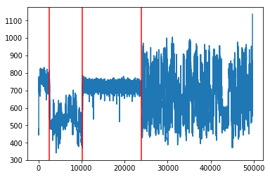

# BOOSTNANO
## BOOSTNANO is a tool for preprocessing ONT-Nanopore RNA sequencing reads(before basecalling), it segmentates the adapter, polyA stall and the transcription from the raw signal.

## Installation
git clone https://github.com/haotianteng/BoostNano.git  
python BoostNano/setup.py install
Install [Pytorch](https://pytorch.org/)  
Add BoostNano path into Python path: export PYTHONPATH=PATH_TO_BOOSTNANO  

## Code Example
Check out the sample code in the Jupyter Notebook Sample.ipynb for how to use the package.  

## Usage
### Inference
```python
python boostnano_eval.py -i INPUT_FAST5_FOLDER -o OUTPUT_FOLDER -m MODEL_FOLDER
```
*Replace the raw signal in the fast5 files for basecalling:*
```python
python boostnano_eval.py -i INPUT_FAST5_FOLDER -o OUTPUT_FOLDER -m MODEL_FOLDER --replace
```
*Notice*: This will save the segmented siganl in to the original Signal Slot in the fast5 files, and copy the old signal into the Signal_Old slot, so a basecaller can directly run on the processed fast5 files.

### Label&Training
```python
python hand_label.py
```
Which give you a GUI to label the data.  
GUI operation:  
S - start  
X - skip the current read  
Q - quit and save  
R - enter into review mode, review the label result or running result by Nanopre  
    reverse the signal(if already in review mode)  

D - go to next signal in review mode  
left click - mark a segment  

Once you get enough labelled data, use boostnano_train.py to train.  

### Review
To review the segmentation result, run hand_label.py and enter in to the review mode, and choose the output folder to review the result.  
  
